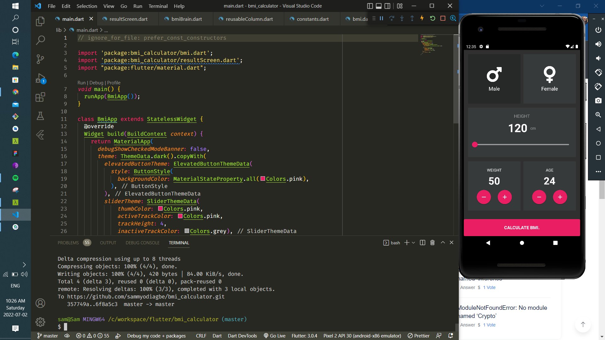

# bmi_calculator

A new Flutter project.

## Getting Started

Learnt a lot from coding out this project
learnt how to structure your app UI
learnt how to navigate between screens
learnt how to break your code into chunks, so as not to have so many files with long codes

### It was fun

# day 32
